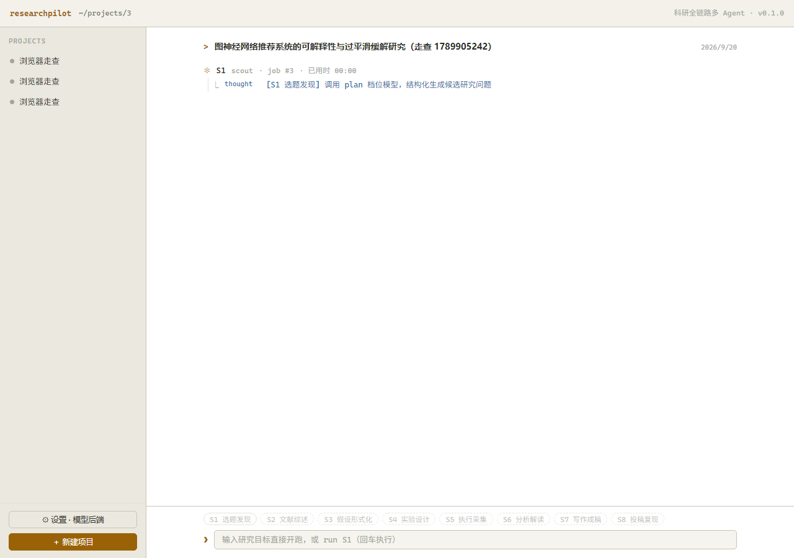
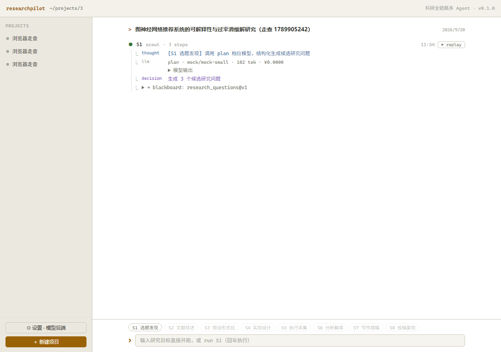

# US-304 §5 前端实时进度走查

Sprint 3 第 9 步的验证据此留档：**受理接口 + SSE 流 + 前端订阅**这一段是否真的让长任务
「全程有进度」。走的是真实浏览器（Playwright / Chromium），不是 TestClient 也不是手工点。

## 环境

| 项 | 值 |
| --- | --- |
| 后端 | `uv run uvicorn app.main:app --port 8000`，`RESEARCHPILOT_DATA_DIR` 指向独立数据目录 |
| 前端 | `npm run dev`（5173，`/api` 反代到 8000） |
| mock 延迟 | `ai.providers.mock.delay_ms = 2500`（真实 `sleep`，制造长任务） |
| 目标文本 | 每次带时间戳，避免命中 `llm_cache` 让延迟消失 |
| 脚本 | `tmp/browser_walkthrough.py`（未入库，落在 gitignore 的 tmp/） |

## 操作路径

1. API 建项目（`goal` 留空）；
2. 浏览器打开 `/projects/{id}`；
3. 在底部命令行**输入研究目标并回车**（US-311 的自由文本入口）→ 前端 `PATCH goal` → `POST .../stages/S1/run` 得到 `{job_id}`；
4. 每 200ms 采样一次会话流文本，直到实时块消失且落库块出现。

## 原样输出

```
=== 0. 建项目（空目标，走命令行入口）===
  project_id=3
=== 2. 输入研究目标并回车 ===

=== 3. 采样时间线 ===
  + 0.02s  行数=0   已用时=None   job=-    运行中=False 落库块=False
  + 0.23s  行数=1   已用时=00:00  job=#3   运行中=True  落库块=False
  + 0.50s  行数=1   已用时=00:00  job=#3   运行中=True  落库块=False
  + 0.70s  行数=1   已用时=00:00  job=#3   运行中=True  落库块=False
  + 0.92s  行数=1   已用时=00:00  job=#3   运行中=True  落库块=False
  + 1.14s  行数=1   已用时=00:01  job=#3   运行中=True  落库块=False
  + 1.36s  行数=1   已用时=00:01  job=#3   运行中=True  落库块=False
  + 1.57s  行数=1   已用时=00:01  job=#3   运行中=True  落库块=False
  + 1.78s  行数=1   已用时=00:01  job=#3   运行中=True  落库块=False
  + 2.00s  行数=1   已用时=00:01  job=#3   运行中=True  落库块=False
  + 2.21s  行数=1   已用时=00:02  job=#3   运行中=True  落库块=False
  + 2.43s  行数=1   已用时=00:02  job=#3   运行中=True  落库块=False
  + 2.65s  行数=1   已用时=00:02  job=#3   运行中=True  落库块=False
  + 2.87s  行数=4   已用时=None   job=-    运行中=False 落库块=True

=== 4. 事件流时间线（后端视角）===
  + 0.000s  seq=1   job.queued
  + 0.003s  seq=2   job.running
  + 0.004s  seq=3   stage.start
  + 0.006s  seq=4   step
  + 2.513s  seq=5   llm.call
  + 2.515s  seq=6   step
  + 2.518s  seq=7   stage.succeeded
  + 2.519s  seq=8   job.succeeded

=== 5. 断言 ===
  [ok] 受理后出现实时块并带 job id — job ids=[3]
  [ok] 实时块在作业结束前就渲染出来 — 共 12 次采样落在实时块上
  [ok] 实时块是部分投影（步数少于落库块） — 实时块最多 1 行 < 落库块 4 行 → 终态确实来自数据库
  [ok] 等待模型期间走秒（≥3 个不同读数） — 读数=['00:00', '00:01', '00:02']
  [ok] 终态后实时块消失 — 最终 job=None
  [ok] 终态后展示落库块（N steps） — 落库块由 load() 重拉得到
  [ok] 落库块含 llm 结算行 — tier · provider/model · tok · ¥cost
  [ok] 等待期间事件流独立投递了 llm.call（分段到达） — 首个 step 与 llm.call 相隔 2.51s

结果：8/8 通过
```

## 截图

运行中（实时块带 `job #3` 与走秒，命令行整条置灰）：



终态（实时块换成落库块：3 steps + llm 结算行 + 黑板写入，命令行恢复可用）：



## 验收对照

| 计划中的验收 | 证据 | 结论 |
| --- | --- | --- |
| 长任务（mock 延迟）全程有进度 | 实时块从 +0.23s 一直存活到 +2.87s，`已用时` 00:00→00:01→00:02 连续走秒 | 通过 |
| `npm run build` + oxlint 通过 | `tsc -b` 0 error、oxlint 0 error / 6 warning（均为改动前既有规则告警）、`vite build` 成功 | 通过 |
| 终态以数据库为准 | 实时块最多 1 行，落库块 4 行 —— 两者不同，说明终态不是把缓冲留在了界面上 | 通过 |
| 流降级路径 | 代码路径（连续 2 次订阅失败 → 1s 轮询 + 提示）本次未触发，未覆盖 | 未覆盖 |

## 已知限制

1. **步骤颗粒度受 Agent 产出形态限制。** S1 现有轨迹是「1 条 `thought` → 1 次模型调用 → 1 条 `decision`」，
   模型调用返回即阶段结束，所以前端能看到的中间态只有 1 步，`llm.call` 事件与终态只差 18ms（seq=5 在 2.513s，seq=8 在 2.519s）。
   这是 S1 的产出形态问题，不是订阅层的问题：订阅层如实渲染收到的每一帧，**能分段就分段**。
   更细的分段要等 Sprint 4 内核的工具调用循环（一次任务要落几十次 `step`）。
2. **实时块内的 `llm` 结算行未被浏览器观测到**，原因同上（它与终态同一批到达）。落库块里的 llm 结算行正常。
3. **「运行中…」占位**只在 `running && steps.length === 0` 时出现，实测窗口约 20ms（首个 `step` 事件在 +6ms 就到了），
   运行时采样抓不到。该分支是防御性状态，留给「启动慢、首步迟」的阶段（如内核工具循环的首轮规划）。
4. **取消按钮未做进界面。** `POST /api/jobs/{id}/cancel` 只对 `queued` 作业有效，正在执行的作业返回 409
   （同步编排跑在工作线程里，硬打断会留下「线程还在写、台账已判死」的错乱状态）。放一个几乎必然 409 的按钮
   只会误导用户，等 Sprint 4 内核支持协作式取消再补。
5. **未做真机网络抖动测试**（断线重连 / `Last-Event-ID` 续传）。续传语义在 `test_jobs_api.py` 里用
   `after_seq` 与 `Last-Event-ID` 两条路径覆盖过，但没在浏览器里断网重连验证。
